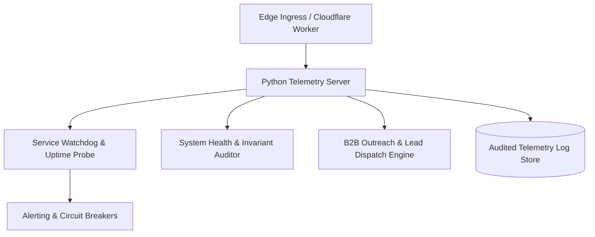

# AI Operations Cockpit: Edge Telemetry & Autonomous Watchdog

Telemetry monitoring, operational health tracking, and workflow automation system combining Cloudflare Edge Workers with a robust Python backend service.



## Architectural Overview

The AI Operations Cockpit provides real-time visibility and automated failure detection across distributed services and autonomous agents. The system isolates operational telemetry behind compact API contracts, continuously auditing system invariants and dispatching corrective alerts.

### Subsystem Breakdown

- **Watchdog Core (`core/watchdog.py`)**: Multi-target availability probe running asynchronous health checks against dependent endpoints, tracking latency percentiles and error rates.
- **Auditor Engine (`core/auditor.py`)**: Evaluates operational compliance, schema drifts, and edge invariants across data pipelines.
- **B2B Outreach Pipeline (`core/trojan_pitcher.py`)**: Automated sales intelligence and verification dispatch system.
- **Storage Subsystem (`core/storage.py`)**: Structured append-only audit persistence for system telemetry and security events.
- **Edge Layer (`.wrangler`, `web/`)**: Low-latency reverse proxy and administrative dashboard interface.

## Technology Stack

- **Backend**: Python 3.11+, Requests, FastAPI / Flask, asyncio
- **Edge**: Cloudflare Workers, Wrangler CLI
- **Frontend**: Clean administrative web interface

## Running Locally

```bash
# Install Python dependencies
pip install -r requirements.txt

# Start telemetry API server
python server.py

# Launch operational watchdog
python core/watchdog.py
```
